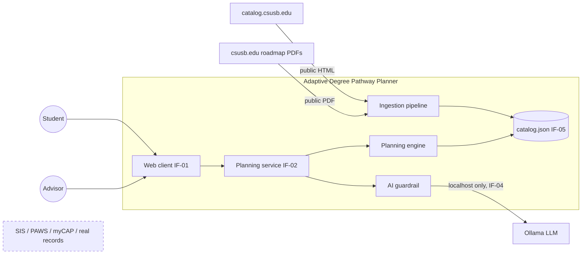
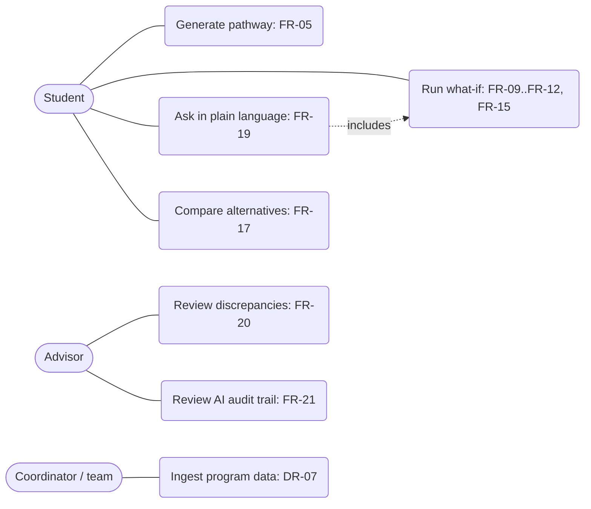
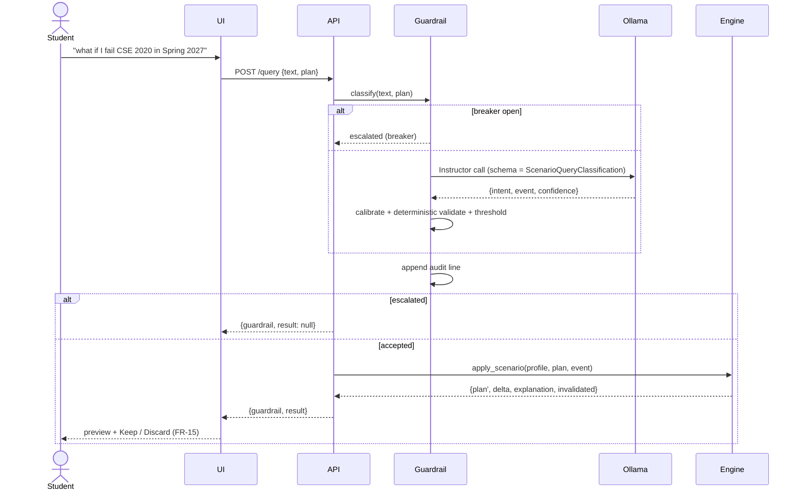
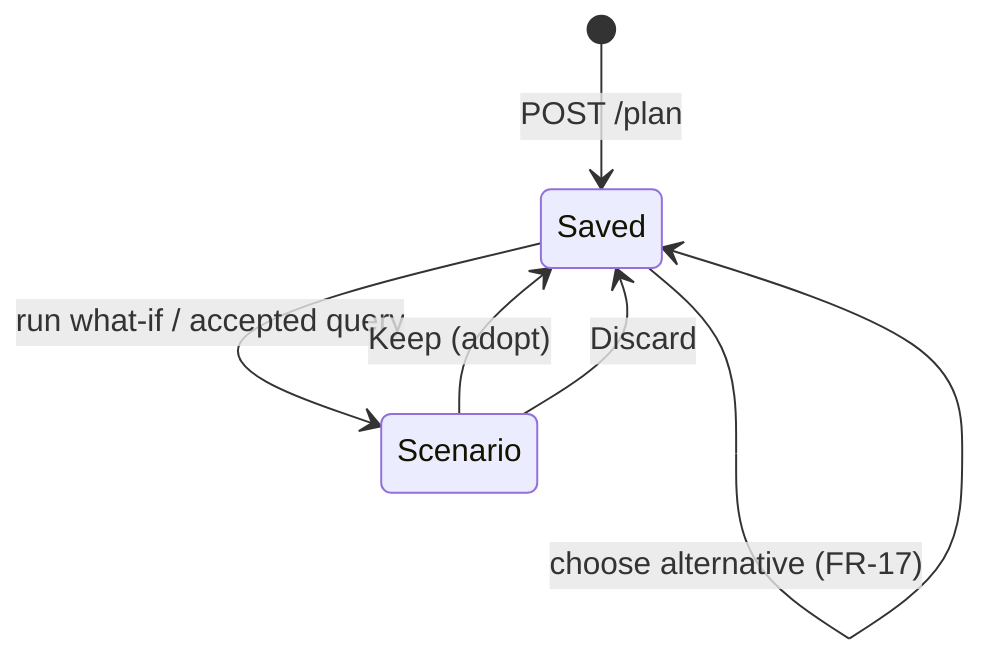
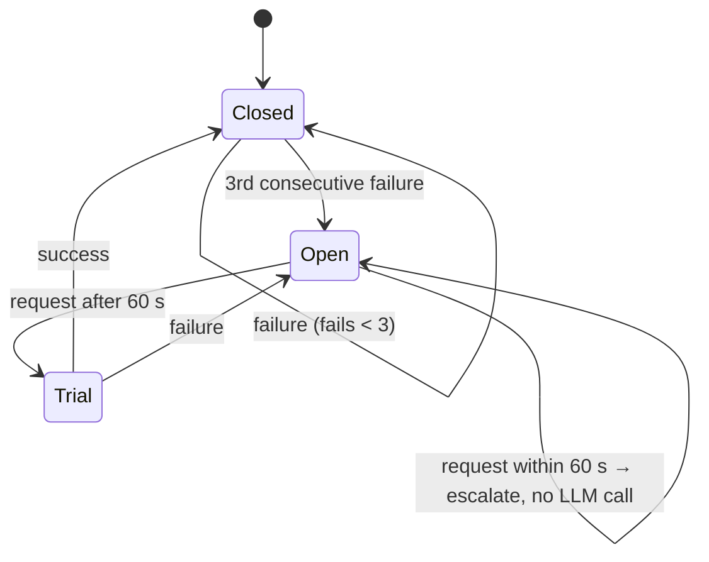
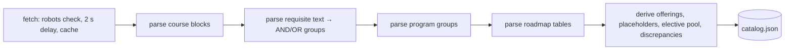

# Models, Architecture, and Design Decisions

This covers system models (Sommerville Ch 5), architectural design (Ch 6), and design and implementation (Ch 7). Requirement IDs refer to the authoritative SRS v0.1 and the proposed [CH-02](../01-product-requirements/srs-change-proposal-CH-02.md). The status of each ID is in the [requirements register](../01-product-requirements/requirements-register.md).

## 1. Architecture Decision Records

Each ADR states the requirement, evidence, or risk that motivated it (course rule: "ADRs should reference the requirements or risks motivating the decision"). Changing an ADR is a change request ([quality-and-cm-plan.md §2.3](../04-quality-security-testing/quality-and-cm-plan.md#23-change-management)).

| ID | Decision | Motivated by | Consequence |
|---|---|---|---|
| ADR-01 | Python planning service, TypeScript/React client, REST between them | SRS LIM-05 (team decision D-01) | FastAPI + Pydantic; the OpenAPI contract is generated (§6) |
| ADR-02 | The **catalog** is authoritative for units and prerequisites. **Roadmaps** are authoritative for sequence and offerings. Disagreements are stored and flagged, never resolved. | DR-08, FR-20; EV-09 findings | 11 discrepancies surfaced; advisors review them |
| ADR-03 | **Generative AI never schedules.** The LLM only classifies a query into a typed `ScenarioEvent`; the deterministic engine does all planning. | FR-19, NFR-12, SRS LIM-03; EV-08; risk R-4 | The AI can be removed with no loss of planning function |
| ADR-04 | **Constrained greedy topological sort** instead of joint optimization | FR-05, NFR-04, PR-02 | Fast (~1 ms) and explainable, but not optimal: it packs GE slots late (EV-07). MILP (PuLP, REF-18) is the upgrade path. |
| ADR-05 | **Self-hosted LLM (Ollama) via Instructor + Pydantic**; the Jev vendor option was dropped | IF-04 ("no planner data sent to external … AI tools"), COM-03; EV-08 | Calibration needs a local model (R-3) |
| ADR-06 | **Stateless API:** the client sends the plan with each scenario | FR-15, NFR-03 | No persistence yet (DR-06 not implemented) |
| ADR-07 | When roadmaps disagree on offering, plan with the **most restrictive** pattern | FR-08; EV-09 §2; CH-02 C-6 | May overstate delays; each conflict is flagged |
| ADR-08 | Prerequisites below program entry (CSE 1250, MATH 1401/1403) are **placement assumptions** | FR-03; EV-02 roadmap assumes calculus-ready freshmen | Listed in `catalog.json` `entry_assumed` |
| ADR-09 | Program data stored as **committed JSON built from committed raw sources** | DR-07, NFR-09 | Reproducible and diffable; single-program scale |
| ADR-10 | A prerequisite **cycle rejects the edge, not the load** | DR-03 (conflict CH-02 C-1); EV-08 | Planning continues; the error is reported |
| ADR-11 | Recalculation re-places the **downstream set plus standing-gated courses** | FR-10, NFR-11; defect found in testing (CSE 4880 senior standing) | Covered by a test |

## 2. System models

### 2.1 Context model

This is the proposed SRS §2.2 figure.



Official systems and real records are outside the boundary (SRS §1.3, COM-03).

### 2.2 Use cases



### 2.3 Interaction models

**Plain-language what-if** (FR-19, FR-21, FR-10):



**Recalculation** (FR-04, FR-10, NFR-11):

```mermaid
sequenceDiagram
  participant E as apply_scenario
  participant G as Catalog DAG
  participant P as place()
  E->>G: descendants(course) ∩ planned from event term
  E->>E: remove that set; keep everything else in place
  E->>E: drop kept courses whose standing no longer holds (+ descendants)
  E->>P: re-place the removed courses from the next term
  P-->>E: new terms
  E->>E: timeline before/after → delta + templated explanation (FR-12)
```

### 2.4 Structural model (DR-01, DR-02)

```mermaid
classDiagram
  class Course {
    id; title; catalog_units; roadmap_units
    discrepancy_flag; term_offered
    requirement_groups; min_standing_units; placeholder
  }
  class PrerequisiteEdge {
    from_course; to_course; condition AND|OR
    group; grade_minimum; concurrent_ok
  }
  class StudentProfile {
    completed_courses{id:grade}; in_progress_courses
    choices; transfer_units; unit_load_preference; start_term
  }
  class Plan { student_id; unit_cap; summers; credited }
  class TermPlan { term_label; courses; total_units; warnings }
  class ScenarioEvent { event_type; course_id; term_label; unit_load }
  class Catalog { courses; g: DiGraph; program; roadmaps; priority; required(profile) }
  class ScenarioQueryClassification { intent; event; confidence }
  Catalog "1" o-- "*" Course
  Catalog "1" o-- "*" PrerequisiteEdge
  Plan "1" *-- "*" TermPlan
  ScenarioQueryClassification --> ScenarioEvent
```

This follows the "Option 3: Hybrid" schema in EV-09 (Data Schema Ideas): the graph is the source of truth, and requirement groups are a view over it.

### 2.5 Behavioral models

**Pathway lifecycle** (FR-15):



**Guardrail circuit breaker** (NFR-12):



**Ingestion** is pipe-and-filter (DR-07, FR-20):



## 3. Architectural views (4+1, Sommerville §6.2)

**Logical view:**

| Abstraction | Module | Requirements allocated (SRS §10) |
|---|---|---|
| Data model | `backend/planner/models.py` | DR-01, DR-02, DR-04 |
| Catalog / DAG / requirement groups | `backend/planner/graph.py` | FR-01, FR-03, DR-03, DR-08 |
| Scheduler and recalculation | `backend/planner/engine.py` | FR-02..FR-15, FR-17, NFR-04, NFR-07, NFR-08, NFR-11 |
| AI guardrail | `backend/planner/guardrail.py` | FR-19, FR-21, NFR-12, NFR-13 |
| Planning service API | `backend/planner/api.py` | IF-02, NFR-03, FR-13, FR-14 |
| Web client | `frontend/src/App.tsx` | IF-01, FR-12, FR-15, NFR-06, NFR-10 |
| Ingestion | `backend/scripts/ingest.py` | DR-07, FR-20, COM-04 |
| Evaluation | `backend/scripts/results.py`, `calibrate.py` | NFR-07, NFR-13 (EV-07) |

**Process view:**

| Process | Lifetime | Talks to |
|---|---|---|
| Browser (React) | Interactive | API via the Vite proxy `/api` |
| `uvicorn planner.api:app` | Long-running, single worker (breaker state is in-process) | Ollama; audit file |
| `ollama serve` | Optional | none |
| `ingest.py`, `results.py`, `calibrate.py` | Batch | Network (ingest only), Ollama (calibrate only) |

**Development view:** the repository layout is in the [README](../../README.md#repository-layout); area owners are in the [agile engineering plan §2](../03-planning-risk/agile-engineering-plan.md#2-team-organization).

**Physical view:** a single developer machine. UI on `:5173`, API on `:8000`, Ollama on `:11434`. CI runs on GitHub-hosted Linux. No production deployment is in scope (SRS §2.6).

**+1 Scenarios:** the use cases in §2.2, each exercised by the release-test scenarios in the [verification strategy §4](../04-quality-security-testing/verification-strategy.md#4-release-testing-83).

## 4. Architectural patterns

| Pattern (Sommerville §6.3) | Where | Why |
|---|---|---|
| Layered | UI → API → engine/guardrail → data | Swap the UI or the LLM without touching planning (ADR-03) |
| Repository | `catalog.json` shared by engine, API, results | One authoritative dataset (ADR-02, ADR-09) |
| Pipe and filter | Ingestion | Each stage testable in isolation |
| Client–server | Browser ↔ FastAPI | Stateless server (ADR-06) |

## 5. Component specifications (Sommerville Fig 4.13 form)

**Generate pathway:** `engine.make_plan(profile, unit_cap)` (FR-03, FR-05..FR-08)

| Field | Content |
|---|---|
| Inputs | StudentProfile; unit cap (default: the profile's preference) |
| Outputs | `Plan{terms[TermPlan{term_label, courses, total_units, warnings}]}` |
| Action | Each term from `start_term`: (1) candidates = remaining courses with standing met, prerequisites met (groups ANDed, alternatives ORed, grade minimum on the +/- scale, corequisites may share the term), offered this term; (2) sort by priority (out-degree + longest downstream chain + 1 if once-a-year), then ID; (3) add while under cap, pulling corequisite partners in right after their lecture; repeat until nothing fits. Summer terms only if selected (cap 8, "Both" courses only). |
| Precondition | Every required course is reachable; otherwise `ValueError` → `422` naming the courses (FR-13, partial) |
| Postcondition | `validate_plan(plan) == []`; same inputs give the same plan (NFR-08) |

**Apply scenario:** `engine.apply_scenario(profile, plan, event)` (FR-09..FR-12, FR-15)

| Field | Content |
|---|---|
| Action | Not passed/Withdrawn: remove the course and its planned descendants from the event term on; re-place from the next term. Passed: credit it; re-place descendants. Add Summer: insert the term; re-place later courses. Change Unit Load: new cap from the event term. Then re-place any kept course whose standing no longer holds (ADR-11). |
| Outputs | `{plan, timeline, invalidated, delta_terms, moved, explanation}`. `moved` lists each course whose term changed (`course`, `from`, `to`); for Pass, `invalidated` is the moved set. The explanation is templated, never LLM-generated. |
| Postcondition | The input plan is unchanged (FR-15); courses outside the removed set keep their term (NFR-11) |

**Classify query:** `guardrail.classify(text, plan)` (FR-19, FR-21, NFR-12)

| Condition | Outcome |
|---|---|
| Breaker open (≥ 3 consecutive failures, < 60 s ago) | escalated |
| LLM error, timeout, retries exhausted | escalated (failure counted) |
| Intent unsupported, or deterministic validation fails (unknown course, course not in that term, term not in plan, unit load outside 3–21) | escalated |
| Calibrated confidence < 0.60 | escalated |
| 0.60 ≤ confidence < 0.90 | accepted_low_confidence → engine runs, flagged |
| ≥ 0.90 | auto_accepted → engine runs |

Every row writes one audit line (FR-21).

## 6. Interface specification (IF-02)

The machine-readable contract is served at `GET /openapi.json` (FastAPI). All bodies are JSON. `Plan` is defined in `backend/planner/models.py`.

| Method, path | Request | Response |
|---|---|---|
| `GET /catalog` | none | `{courses[], edges[], priority{}, discrepancies[]}` |
| `GET /students` | none | `StudentProfile[]` (synthetic) |
| `POST /plan` | `{"student_id": "alex", "unit_cap": 15}` | `{plan, timeline, alternatives{fastest, balanced}}`; 404 unknown student; 422 unschedulable |
| `POST /scenario` | `{"plan": Plan, "event": {"event_type": "Fail", "course_id": "CSE 2020", "term_label": "Spring 2027"}}` | `{plan, timeline, invalidated[], delta_terms, moved[], explanation}`; 400 if the event doesn't fit the plan or the unit load is outside 3–21 |
| `POST /validate` | `{"plan": Plan}` | `{"problems": [...]}`: empty if valid (FR-14) |
| `POST /query` | `{"text": "...", "plan": Plan}` | `{guardrail{outcome, confidence, reason, parsed_event}, result or null}` |
| `GET /audit?limit=50` | none | audit lines, newest first |

## 7. Implementation notes (Ch 7)

- **Design patterns:**
  - *Circuit Breaker*: the guardrail.
  - *Dependency injection*: `classify(text, plan, llm=...)`, so tests run with no network.
  - *Template method* for explanations: FR-12 text is never LLM-generated.
- **Reuse:** NetworkX, Pydantic, FastAPI, Instructor, scikit-learn, structlog, pdfplumber, BeautifulSoup, Reagraph. Only the per-term greedy packing is hand-written.
- **Host–target:** develop on Windows, CI on Linux. `pathlib` and explicit UTF-8 throughout.
- **Licensing:** all dependencies are permissive (MIT/BSD/Apache). CSUSB content is used for coursework in a private repo, not redistributed.
