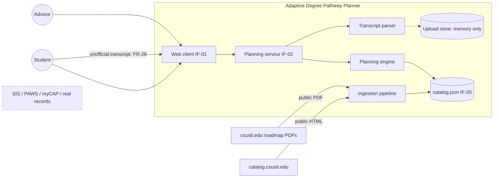
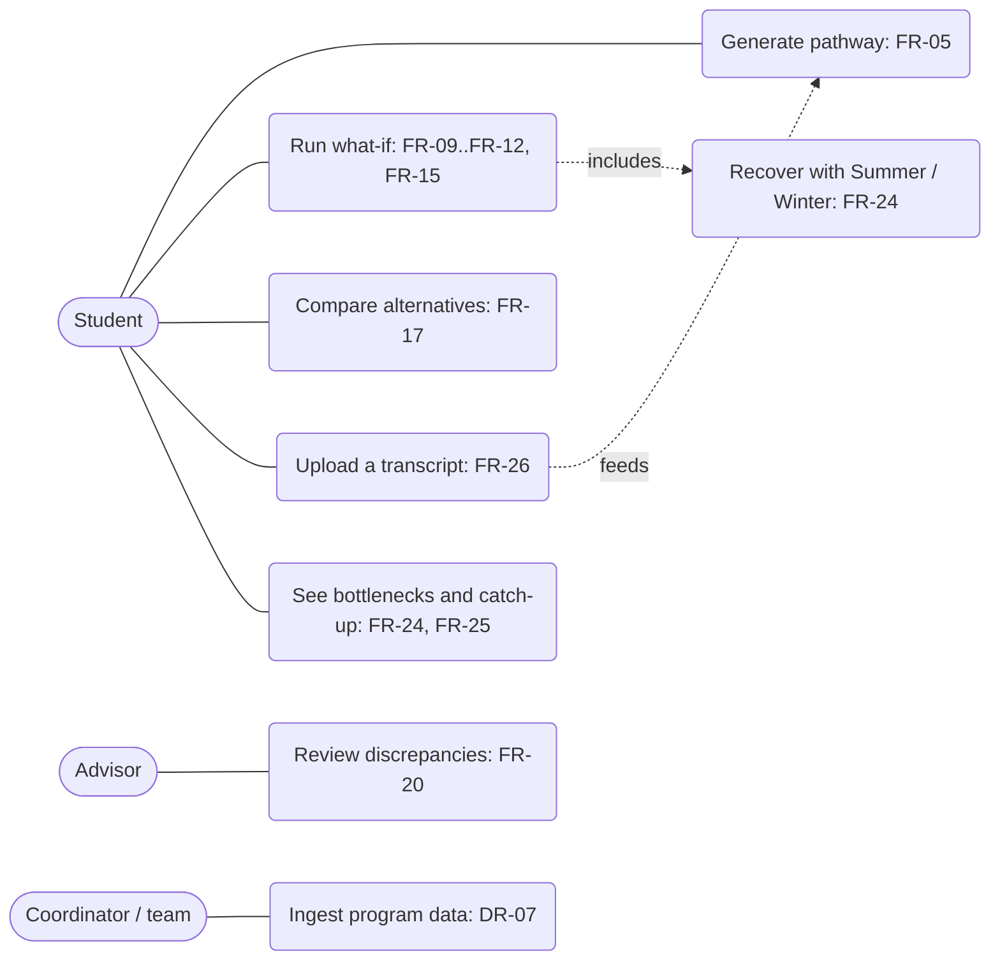
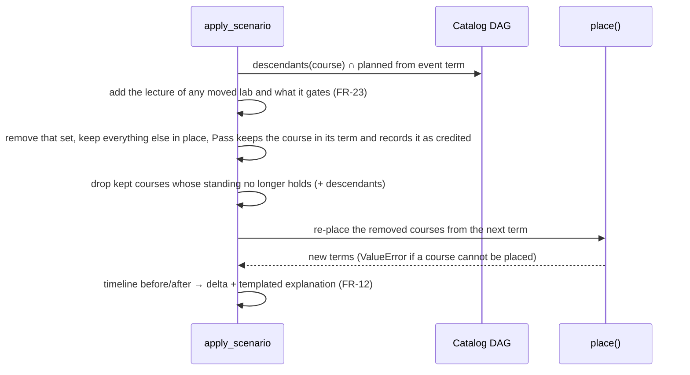
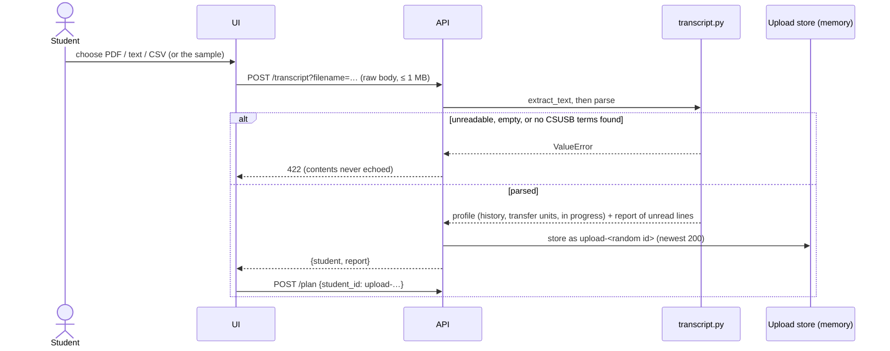
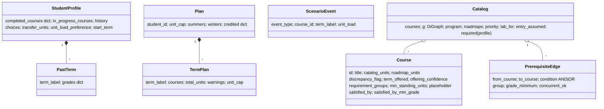
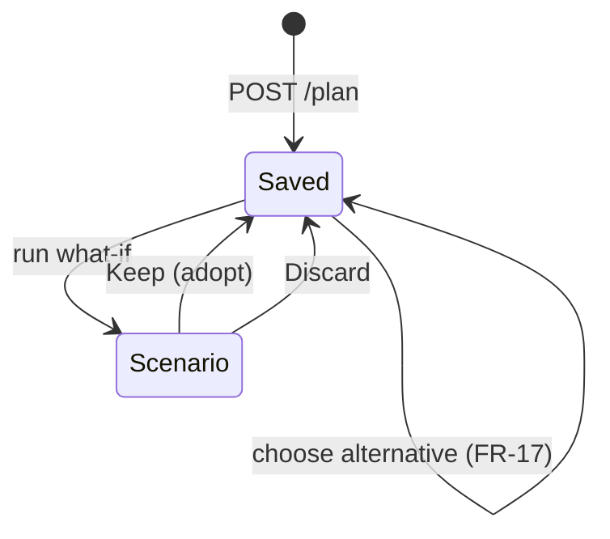
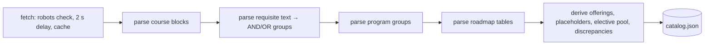

# Models, Architecture, and Design Decisions

> [Docs index](../README.md) · [Design and ADRs](design.md) · [UML diagrams](uml-diagrams.md)

**Contents:** [1 ADRs](#1-architecture-decision-records) · [2 System models](#2-system-models) · [3 Architectural views](#3-architectural-views-41-sommerville-62) · [4 Patterns](#4-architectural-patterns) · [5 Component specs](#5-component-specifications-sommerville-fig-413-form) · [6 API contract](#6-interface-specification-if-02) · [7 Implementation notes](#7-implementation-notes-ch-7)

This covers system models (Sommerville Ch 5), architectural design (Ch 6), and design and implementation (Ch 7). Requirement IDs refer to the authoritative SRS v0.1 and the proposed [CH-02](../01-product-requirements/srs-change-proposal-CH-02.md). The status of each ID is in the [requirements register](../01-product-requirements/requirements-register.md).

## 1. Architecture Decision Records

Each ADR states the requirement, evidence, or risk that motivated it (course rule: "ADRs should reference the requirements or risks motivating the decision"). Changing an ADR is a change request ([quality-and-cm-plan.md §2.3](../04-quality-security-testing/quality-and-cm-plan.md#23-change-management)).

| ID | Decision | Motivated by | Consequence |
|---|---|---|---|
| ADR-01 | Python planning service, TypeScript/React client, REST between them | SRS LIM-05 (team decision D-01) | FastAPI + Pydantic; the OpenAPI contract is generated (§6) |
| ADR-02 | The **catalog** is authoritative for units and prerequisites. **Roadmaps** are authoritative for sequence and offerings. Disagreements are stored and flagged, never resolved. | DR-08, FR-20; EV-09 findings | 11 discrepancies surfaced; advisors review them |
| ADR-04 | **Constrained greedy topological sort** instead of joint optimization | FR-05, NFR-04, PR-02 | Fast (~1 ms) and explainable, but not optimal: it packs GE slots late (EV-07). MILP (PuLP, REF-18) is the upgrade path. |
| ADR-06 | **Stateless API:** the client sends the plan with each scenario. The one exception is uploaded transcripts (ADR-15). | FR-15, NFR-03 | No persistence yet (DR-06 not implemented) |
| ADR-07 | When roadmaps disagree on offering, plan with the **most restrictive** pattern | FR-08; EV-09 §2; CH-02 C-6 | May overstate delays; each conflict is flagged |
| ADR-08 | Prerequisites below program entry (CSE 1250, MATH 1401/1403) are **placement assumptions** | FR-03; EV-02 roadmap assumes calculus-ready freshmen | Listed in `catalog.json` `entry_assumed` |
| ADR-09 | Program data stored as **committed JSON built from committed raw sources** | DR-07, NFR-09 | Reproducible and diffable; single-program scale |
| ADR-10 | A prerequisite **cycle rejects the edge, not the load** | DR-03 (conflict CH-02 C-1); EV-08 | Planning continues; the error is reported |
| ADR-11 | Recalculation re-places the **downstream set plus standing-gated courses** | FR-10, NFR-11; defect found in testing (CSE 4880 senior standing) | Covered by a test |
| ADR-12 | A **lab is always placed in its lecture's term** and moves with it (`Catalog.lab_for`). A passed half stays put; its partner is retaken alone. | FR-23; EV-02 (catalog lists the lecture as a corequisite, which alone would allow a later term) | The validator flags a split pair |
| ADR-13 | **Summer and Winter are opt-in** and planned lighter than their maximums (summer 7 of 14, winter 4 of 4; fall/spring maximum 18). Only courses offered in both regular terms are candidates, and every placement is flagged unconfirmed. | FR-07, FR-22; EV-12 (Registrar limits); CH-03 §C-1 | Real intersession offerings are unpublished, so these placements are an assumption |
| ADR-14 | **Catch-up search is greedy with pair lookahead** (`recover()`), built from ordinary what-if events. Risk is measured by failing one course at a time (`course_risk()`). | FR-24, FR-25; CH-03 §C-4 | Fast (< 0.5 s), but can miss a combination of three or more terms that only works together |
| ADR-15 | **Uploaded transcripts live in process memory only** (newest 200), never on disk and never logged. | FR-26; CH-04 §C-1, §C-2; COM-03 | Restarting the API clears them. Real-record use still needs a team decision (CH-04 §C-1). |

## 2. System models

### 2.1 Context model

This is the proposed SRS §2.2 figure.

Official systems and real records are outside the boundary (SRS §1.3, COM-03).

### 2.2 Use cases

### 2.3 Interaction models

**Recalculation** (FR-04, FR-10, NFR-11):

`apply_scenario` does not call `validate_plan`. Validity comes from `place()` applying the rules as it builds terms, and tests plus the fuzz harness check the output with the independent validator (NFR-07). `POST /validate` is a separate endpoint for hand-edited plans and roadmaps.

**Transcript upload** (FR-26):

### 2.4 Structural model (DR-01, DR-02)

`event_type` is one of Pass, Fail, Withdraw, Add Summer, Add Winter, Change Unit Load. The SRS calls Fail "Not passed". `unit_cap` on a `TermPlan` is the cap the engine used for that term (summer 7, winter 4). `Catalog.discrepancies` holds the logged catalog/roadmap disagreements and rejected cycle edges.

This follows the "Option 3: Hybrid" schema in EV-09 (Data Schema Ideas): the graph is the source of truth, and requirement groups are a view over it.

### 2.5 Behavioral models

**Pathway lifecycle** (FR-15):

Keep pushes the previewed plan onto the client's history, so Undo last and Reset to baseline walk it back. Nothing is stored server-side.

**Ingestion** is pipe-and-filter (DR-07, FR-20):

## 3. Architectural views (4+1, Sommerville §6.2)

**Logical view:**

| Abstraction | Module | Requirements allocated (SRS §10) |
|---|---|---|
| Data model | `backend/planner/models.py` | DR-01, DR-02, DR-04 |
| Catalog / DAG / requirement groups | `backend/planner/graph.py` | FR-01, FR-03, DR-03, DR-08 |
| Scheduler and recalculation | `backend/planner/engine.py` | FR-02..FR-15, FR-17, NFR-04, NFR-07, NFR-08, NFR-11 |
| Planning service API | `backend/planner/api.py` | IF-02, NFR-03, FR-13, FR-14 |
| Transcript parser | `backend/planner/transcript.py` | FR-26, DR-04 |
| Web client | `frontend/src/App.tsx`, `PrereqMap.tsx` (SVG map), `Logo.tsx` | IF-01, FR-12, FR-15, FR-25, NFR-06, NFR-10 |
| Ingestion | `backend/scripts/ingest.py` (BS CS catalog), `ingest_all.py` (every subject, 84 subjects, `data/all_courses.json`), `outliers.py` (screens it) | DR-07, FR-20, COM-04 |
| Evaluation | `backend/scripts/results.py` | NFR-07 (EV-07) |

**Process view:**

| Process | Lifetime | Talks to |
|---|---|---|
| Browser (React) | Interactive | API via the Vite proxy `/api` |
| `uvicorn planner.api:app` | Long-running, single worker (the transcript upload store is in-process) | none |
| `ingest.py`, `ingest_all.py`, `outliers.py`, `results.py` | Batch | Network (the two ingest scripts only) |

**Development view:** the repository layout is in the [README](../../README.md#repository-layout); area owners are in the [agile engineering plan §2](../03-planning-risk/agile-engineering-plan.md#2-team-organization).

**Physical view:** a single developer machine. UI on `:5173`, API on `:8000`. CI runs on GitHub-hosted Linux. No production deployment is in scope (SRS §2.6). The demo is also published as a static site on GitHub Pages: there is no server, and the same FastAPI app runs in a Web Worker under Pyodide (`planner/browser.py`, `frontend/src/backend.ts`). PDF transcript upload is unavailable there because pdfplumber has no Pyodide build.

**+1 Scenarios:** the use cases in §2.2, each exercised by the release-test scenarios in the [verification strategy §4](../04-quality-security-testing/verification-strategy.md#4-release-testing-83).

## 4. Architectural patterns

| Pattern (Sommerville §6.3) | Where | Why |
|---|---|---|
| Layered | UI → API → engine → data | Swap the UI without touching planning |
| Repository | `catalog.json` shared by engine, API, results | One authoritative dataset (ADR-02, ADR-09) |
| Pipe and filter | Ingestion | Each stage testable in isolation |
| Client–server | Browser ↔ FastAPI | Stateless server (ADR-06) |

## 5. Component specifications (Sommerville Fig 4.13 form)

**Generate pathway:** `engine.make_plan(profile, unit_cap)` (FR-03, FR-05..FR-08)

| Field | Content |
|---|---|
| Inputs | StudentProfile; unit cap (default: the profile's preference) |
| Outputs | `Plan{terms[TermPlan{term_label, courses, total_units, warnings, unit_cap}]}` |
| Action | Each term from `start_term`: (1) candidates = remaining courses with standing met and prerequisites met (groups ANDed, alternatives ORed, grade minimum on the +/- scale, corequisites may share the term); (2) sort by priority (out-degree + longest downstream chain + 1 if once-a-year), then ID; (3) add a course only if it is offered this term and fits under the cap, together with its lab (a lab goes in only with its lecture) and any corequisite partner; repeat until nothing fits. Summer (planned cap 7) and Winter (cap 4) terms exist only if selected and take only "Both" courses. Stops with an error after 30 terms. |
| Precondition | Every required course is reachable and no course exceeds the cap; otherwise `ValueError` → `422` naming each blocking course and constraint (FR-13) |
| Postcondition | `validate_plan(plan) == []`; same inputs give the same plan (NFR-08) |

**Apply scenario:** `engine.apply_scenario(profile, plan, event)` (FR-09..FR-12, FR-15)

| Field | Content |
|---|---|
| Action | Fail/Withdraw: remove the course and its planned descendants from the event term on (a moved lab takes its lecture along, ADR-12); re-place from the next term; a retake revokes any earlier Pass of the course or its dependents. Pass: credit the course in its term; re-place descendants. Add Summer / Add Winter: insert the opted-in term; re-place later courses. Change Unit Load: new cap from the event term (3–21). Then re-place any kept course whose standing no longer holds (ADR-11). |
| Outputs | `{plan, timeline, invalidated, delta_terms, moved, explanation}`. `moved` lists each course whose term changed (`course`, `from`, `to`); for Pass, `invalidated` is the moved set. The explanation is templated (FR-12). The API adds `recovery` when graduation slips (ADR-14). |
| Errors | `ValueError` for an unknown course, a term not in the plan, a course not planned in that term, or an unplaceable course → `400` |
| Postcondition | The input plan is unchanged (FR-15); courses outside the removed set keep their term (NFR-11) |

## 6. Interface specification (IF-02)

The machine-readable contract is served at `GET /openapi.json` (FastAPI). All bodies are JSON. `Plan` is defined in `backend/planner/models.py`.

| Method, path | Request | Response |
|---|---|---|
| `GET /health` | none | `{engine, unit_load_range}` |
| `GET /catalog` | none | `{courses[], edges[], priority{}, discrepancies[]}` |
| `GET /students` | none | `StudentProfile[]` (synthetic) |
| `POST /plan` | `{"student_id": "alex", "unit_cap": 15}` | `{plan, timeline, alternatives{fastest, balanced, "with summer & winter"}}` (the last only when intersessions help); 404 unknown student; 422 if `unit_cap` is outside 3–21 or the plan is unschedulable (names each blocking course and why, FR-13) |
| `POST /scenario` | `{"plan": Plan, "event": {"event_type": "Fail", "course_id": "CSE 2020", "term_label": "Spring 2027"}}` | `{plan, timeline, invalidated[], delta_terms, moved[], explanation, recovery?}`; `recovery` (FR-24) appears when graduation slips and holds `{adds[], plan, timeline, explanation, moved, delta_terms}`; 400 if the event doesn't fit the plan or the unit load is outside 3–21; 422 if the plan body is malformed |
| `POST /risk` | `{"plan": Plan}` | `{course: {term, delay, catch_up[], after_catch_up}}` for every planned course that is not a GE/free-elective slot (FR-25) |
| `POST /validate` | `{"plan": Plan}` | `{"problems": [...]}`: empty if valid (FR-14) |
| `POST /transcript?filename=` | raw PDF, text, or CSV body (≤ 1 MB, PDF ≤ 30 pages) | `{student, report}`; the student id is `upload-…` and is accepted by every endpoint above; 400 empty; 422 unreadable or no CSUSB courses found (FR-26) |
| `GET /transcript/sample` | none | a synthetic transcript as plain text |

Every response carries `X-Content-Type-Options`, `X-Frame-Options`, and `Referrer-Policy` headers. A body over 1,000,000 bytes gets `413`, and a non-numeric `Content-Length` gets `400`.

## 7. Implementation notes (Ch 7)

- **Design patterns:**
  - *Template method* for explanations (FR-12).
- **Reuse:** NetworkX, Pydantic, FastAPI, pdfplumber, BeautifulSoup. Hand-written: the per-term greedy packing, the catch-up search, the transcript parser, and the SVG prerequisite map (it replaced Reagraph in v0.6).
- **Host–target:** develop on Windows, CI on Linux. `pathlib` and explicit UTF-8 throughout.
- **Licensing:** all dependencies are permissive (MIT/BSD/Apache). CSUSB content is used for coursework in a private repo, not redistributed.
