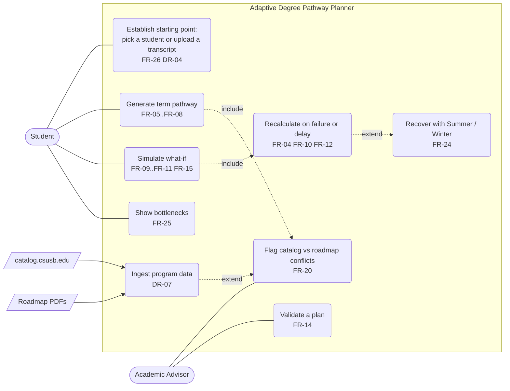
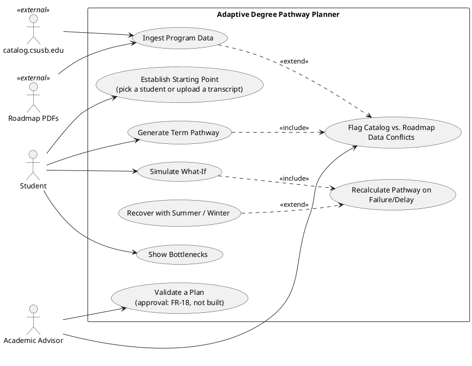
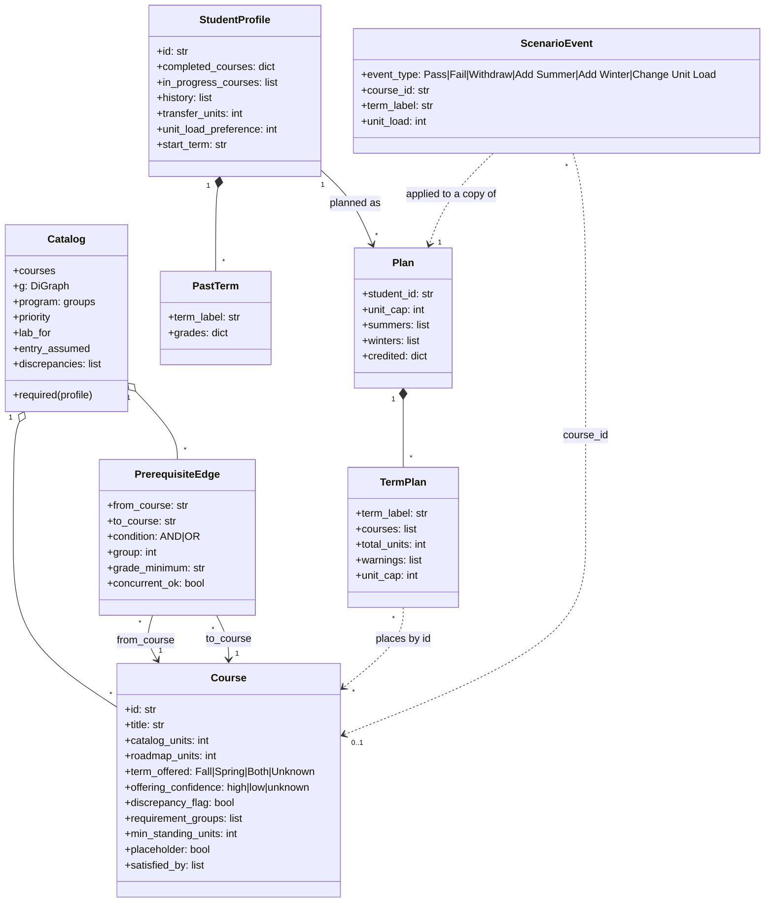
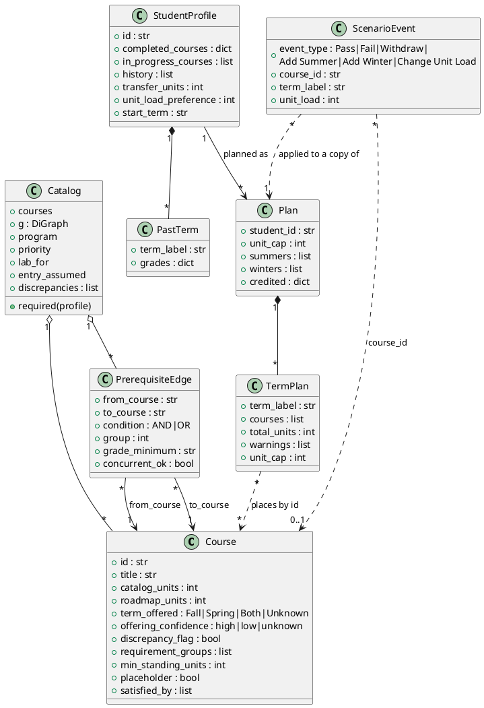
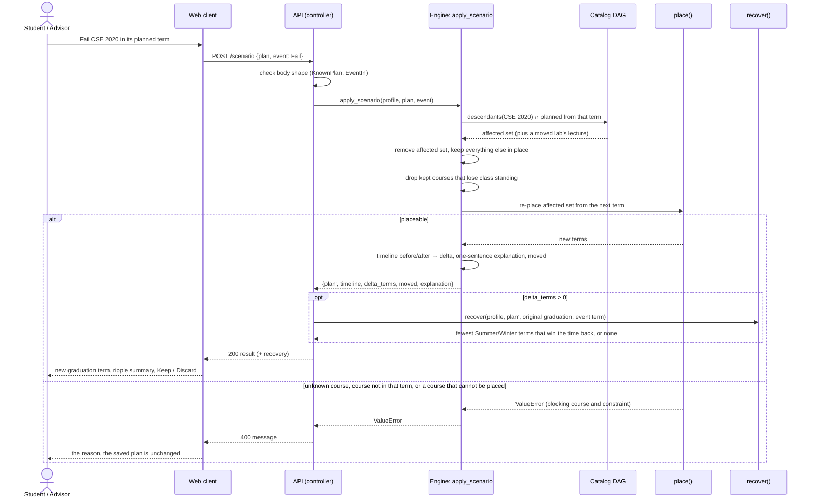
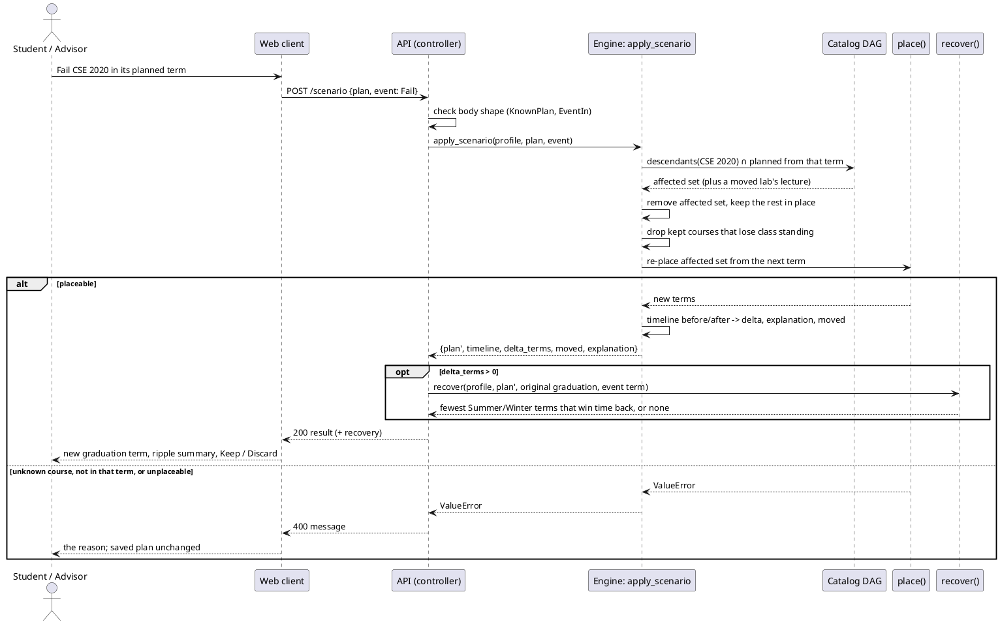
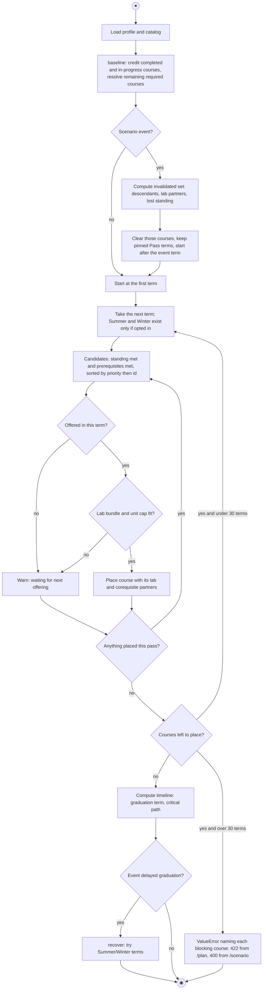
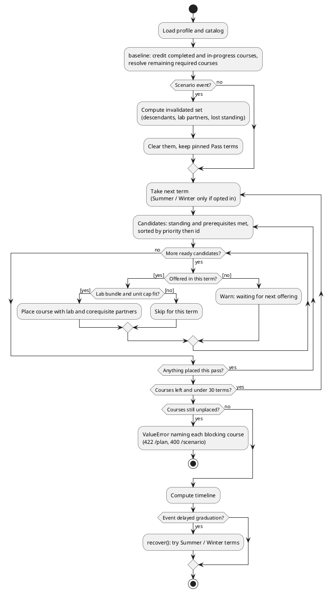
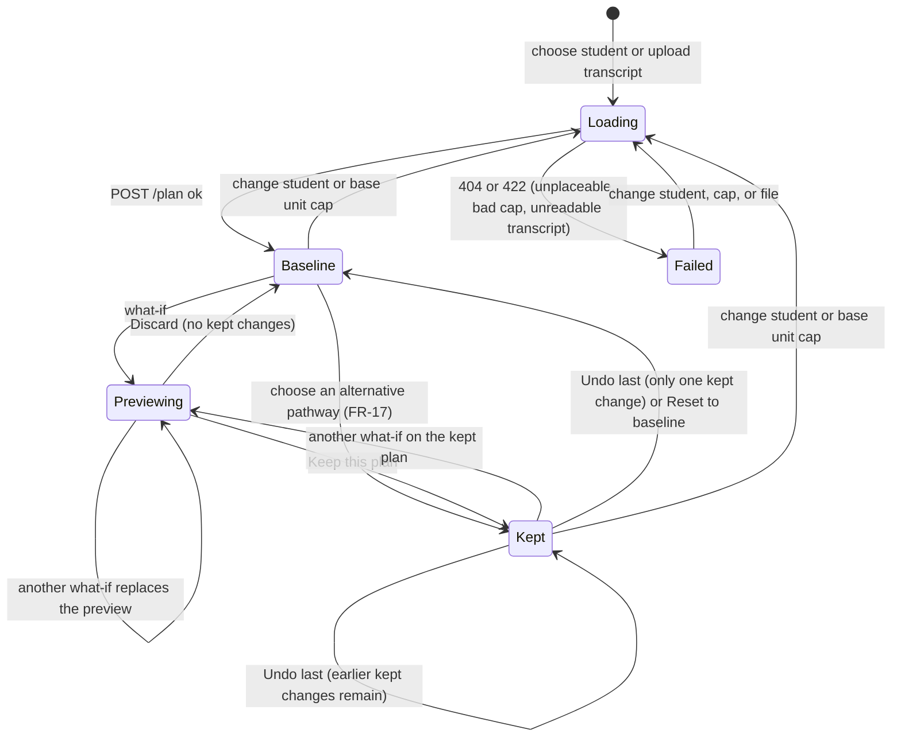
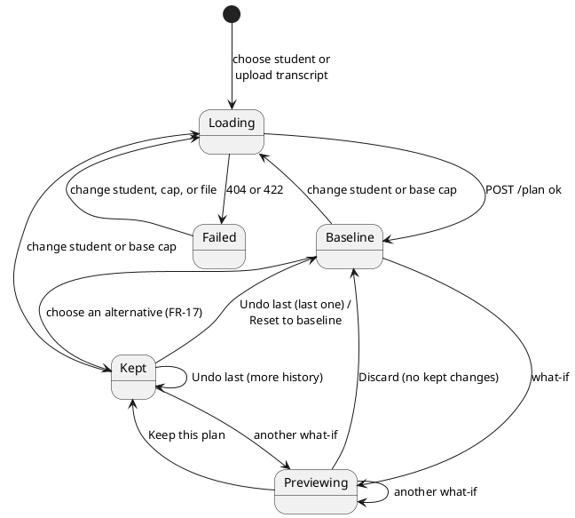

# UML Diagram Set (Sommerville Ch 5)

> [Docs index](../README.md) · [Design and ADRs](design.md) · [UML diagrams](uml-diagrams.md)

**Contents:** [1 Context and use cases](#1-context-and-use-cases) · [2 Class diagram](#2-class-diagram-structure) · [3 Sequence diagram](#3-sequence-diagram-recalculation-after-failing-cse-2020) · [4 Activity diagram](#4-activity-diagram-pathway-generation-and-recalculation) · [5 State diagram](#5-state-diagram-pathway-lifecycle)

Five perspectives, each in Mermaid (renders in GitHub) and PlantUML (for export). They extend the models in [design.md §2](design.md#2-system-models), use the same requirement IDs, and were checked against the code on 2026-09-29 (`engine.py`, `api.py`, `models.py`, `graph.py`). Names in the diagrams are the code's names.

Some elements of the original modeling brief are not in the code. The diagrams show what exists:

| Brief element | What the code has |
|---|---|
| Advisor "Validate & Approve Plan", `ApprovedBaseline` state | Validation exists (`POST /validate`, FR-14); approval and the advisor view do not (FR-18) |
| `RequirementGroup` class | Data only: `Catalog.program["groups"]`, resolved by `Catalog.required()` |
| `DataConflictWarning` class | Strings in `Catalog.discrepancies`, plus `results/roadmap_audit.json` (FR-20) |
| `ScenarioController`, `ConstraintValidator`, `TimelineAnalyzer` | `api.py`, the rules inside `place()`, and `timeline()` |
| Catalog Scraper and Roadmap Parser as external actors | Inside the boundary (`scripts/ingest.py`); the external systems are catalog.csusb.edu and the roadmap PDFs |
| Parallel GE / core planning | One greedy pass over a single priority-ordered candidate list; GE slots are placeholder courses |

## 1. Context and use cases

**Summary.** Shows the system boundary and who uses it (SRS §2.2, IF-01..IF-05). The two public sources are external actors for the ingestion subsystem. "Simulate what-if" includes recalculation, and recalculation offers Summer/Winter catch-up when graduation slips. Students can start from a synthetic profile or an uploaded transcript.

## 2. Class diagram (structure)

**Summary.** The domain model for DR-01/DR-02. The prerequisite graph is the source of truth: `PrerequisiteEdge` links two `Course`s, and requirement groups are a view over it (EV-09 hybrid schema, ADR-02). `Course.discrepancy_flag` and `Catalog.discrepancies` are where catalog and roadmap disagreements surface. A `StudentProfile` carries its term-by-term `history` (DR-04), and a `Plan` records the opted-in Summer/Winter terms and the courses credited by Pass events.

`RequirementGroup` and `DataConflictWarning` from the modeling brief are not classes: groups are `Catalog.program["groups"]` resolved by `Catalog.required()`, and conflicts are strings in `Catalog.discrepancies` plus `results/roadmap_audit.json`.

## 3. Sequence diagram: recalculation after failing CSE 2020

**Summary.** Traces FR-04, FR-10, FR-12, FR-24 and NFR-11 for the highest-impact bottleneck course. The API is the controller. `apply_scenario` removes the failed course and its planned descendants, re-places them from the next term, and returns the before/after delta. The API then runs `recover()` when graduation slipped. The `alt` branches are a valid result and an unplaceable or mismatched request, which `/scenario` answers with 400. `apply_scenario` does not call `validate_plan`: the rules are applied inside `place()`, and `/validate` is a separate endpoint. There is no authorization branch because the API has no sign-in yet (NFR-01, OQ-06).

## 4. Activity diagram: pathway generation and recalculation

**Summary.** The process behind FR-03..FR-08, FR-10, FR-13 and FR-24, and the source for the SRS §6 rules. `make_plan` calls `place()`; `apply_scenario` clears the invalidated part of a plan and calls the same `place()`. Each term repeats a candidate pass, because a corequisite or lab placed in the term can unlock its partner. The guards are the ones in the code: standing, prerequisites, offering, and the unit cap. There is no parallel branch: GE and core courses share one priority-ordered candidate list. Mermaid has no activity diagram, so it is a flowchart.

## 5. State diagram: pathway lifecycle

**Summary.** The lifecycle the code implements for a plan, as the client drives it (FR-15, FR-17). The server is stateless, so every state lives in the browser (the current plan, the preview, and the stack of kept plans). The brief's `ValidatingConstraints` / `ConflictFlagged` / `ApprovedBaseline` states do not exist: the engine enforces the rules while placing, `/validate` is a stateless check, and approval needs the advisor view (FR-18).

A 400 while previewing shows a message and leaves the current plan as it was.

