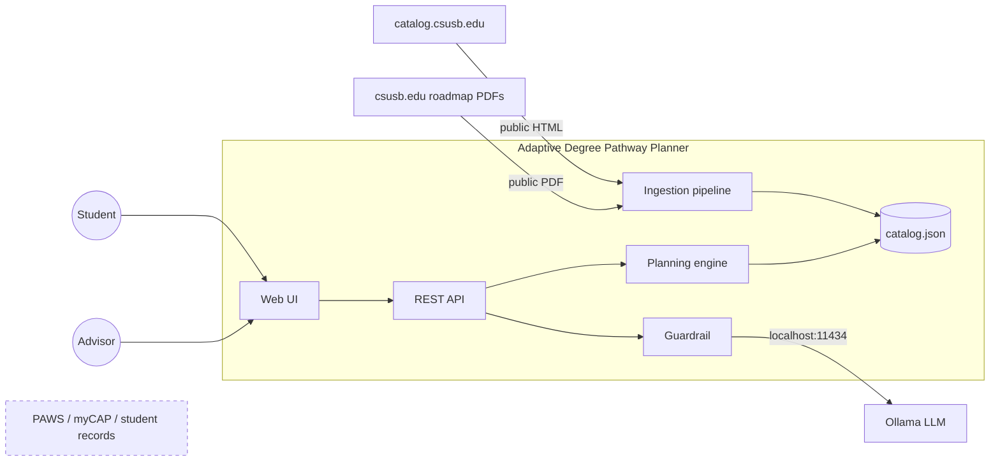
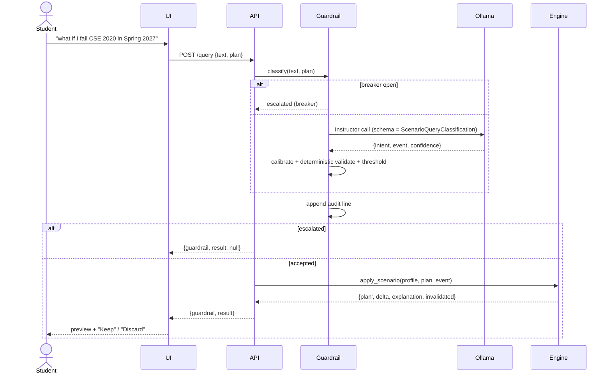
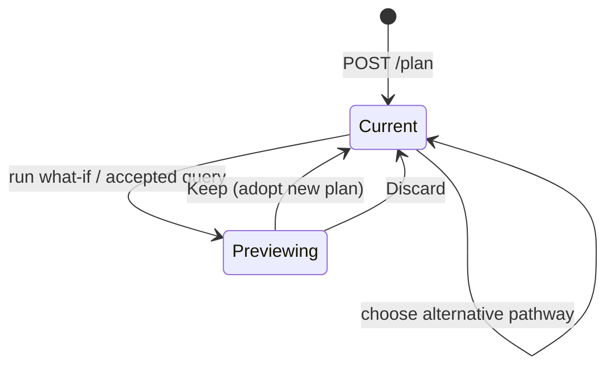
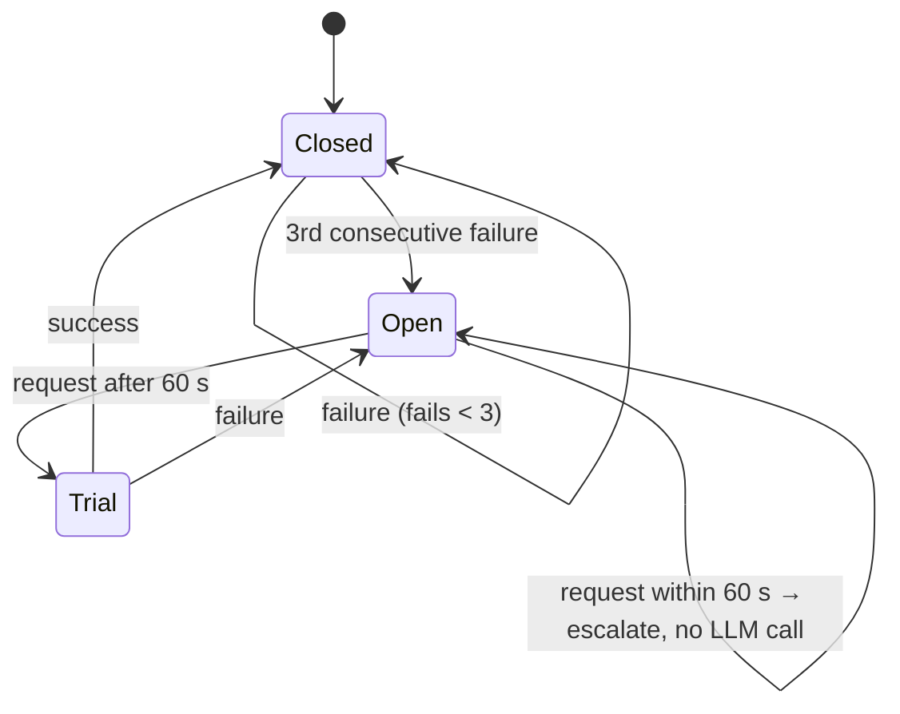
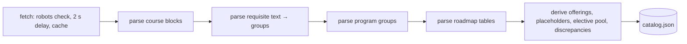

# Design: Adaptive Degree Pathway Planner

This covers system models (Sommerville Ch 5), architectural design (Ch 6), and design and implementation (Ch 7). Requirements IDs refer to [SRS.md](SRS.md).

## 1. Architectural design decisions (ADRs)

Each record gives the decision, the reason, and what it costs. Changing an ADR is a change request ([QUALITY_AND_CM.md §2.3](QUALITY_AND_CM.md#23-change-management)).

| ID | Decision | Why | Consequence |
|---|---|---|---|
| ADR-1 | The **catalog** is authoritative for units and prerequisites. **Roadmaps** are authoritative for sequence and term offerings. Disagreements are logged, never resolved. | Spec source-of-truth ADR; the audit found 4+ conflicts. | FR-10, NFR-8. Advisors see every conflict. |
| ADR-2 | **Generative AI never schedules.** The LLM only classifies a query into a typed `ScenarioEvent`; the deterministic engine does all planning. | Spec AI-grounding ADR; mirrors CMU Course Advisor. | FR-9, NFR-3. The AI can be removed without losing any planning function (NFR-4). |
| ADR-3 | **Constrained greedy topological sort**, not joint optimization. | Joint course-to-term assignment is NP-hard; greedy is O(V+E) per term and explainable. | Not optimal: it packs GE slots late (see results). MILP via PuLP is the documented upgrade (SRS §8). |
| ADR-4 | **Self-hosted LLM (Ollama) via Instructor + Pydantic.** | Jev dropped (closed, unpriced, retention unknown); keeps query text local (NFR-12). | Needs a local model to run calibration (RISKS R-3). |
| ADR-5 | **Stateless API:** the client sends the plan with each scenario. | No persistence needed for a mock; what-if is naturally non-destructive (FR-8). | Plans live in the browser; SQLite later (SRS §8). |
| ADR-6 | When roadmaps disagree on offering, use the **most restrictive** offering. | Never schedule a course in a term it may not run (FR-7). | Can overstate delays; the conflict is logged for an advisor. |
| ADR-7 | Prerequisites below program entry (CSE 1250, MATH 1401/1403) are **placement assumptions**. Electives gated by out-of-program courses are excluded from default picks. | The roadmap assumes calculus-ready freshmen. | Stated in `catalog.json` `assumptions` and `entry_assumed`. |
| ADR-8 | **JSON files** for catalog, students, and datasets; the raw sources are committed. | Reproducible and diffable (FR-12); no DB until needed. | Single-program scale only. |
| ADR-9 | The recalculation ripple set = DAG descendants **plus standing-gated courses**. | Found in testing: failing a course can drop a student below senior standing for a course the DAG doesn't link. | FR-4; covered by a test. |

## 2. System models

### 2.1 Context model

What is inside the system boundary, and what isn't.



PAWS, myCAP, and real student records are deliberately **outside** the boundary (NFR-6).

### 2.2 Interaction models

**Plain-language what-if** (UC3; FR-9, FR-11, FR-4):



**Recalculation** (FS-2):

```mermaid
sequenceDiagram
  participant E as apply_scenario
  participant G as Catalog DAG
  participant P as place()
  E->>G: descendants(course) ∩ planned from event term
  E->>E: remove ripple set; keep everything else in place
  E->>E: drop kept courses whose standing no longer holds (+ descendants)
  E->>P: re-place ripple set from next term
  P-->>E: new terms
  E->>E: timeline before/after → delta + templated explanation
```

### 2.3 Structural model

```mermaid
classDiagram
  class Course {
    id; title; catalog_units; roadmap_units
    discrepancy_flag; term_offered
    requirement_groups; min_standing_units; placeholder
  }
  class PrerequisiteEdge {
    from_course; to_course; condition AND|OR
    group; grade_minimum; concurrent_ok
  }
  class StudentProfile {
    completed_courses{id:grade}; in_progress_courses
    choices; transfer_units; unit_load_preference; start_term
  }
  class Plan { student_id; unit_cap; summers; credited }
  class TermPlan { term_label; courses; total_units; warnings }
  class ScenarioEvent { event_type; course_id; term_label; unit_load }
  class Catalog { courses; g: DiGraph; program; roadmaps; priority; required(profile) }
  class ScenarioQueryClassification { intent; event; confidence }
  Catalog "1" o-- "*" Course
  Catalog "1" o-- "*" PrerequisiteEdge
  Plan "1" *-- "*" TermPlan
  ScenarioQueryClassification --> ScenarioEvent
```

### 2.4 Behavioral models

**Plan lifecycle in the UI** (FR-8):



**Guardrail circuit breaker** (NFR-4):



**Ingestion** is a pipe-and-filter activity (FR-12):



## 3. Architectural views (4+1, Sommerville §6.2)

**Logical view:** key abstractions and where they live.

| Abstraction | Module | Responsibility |
|---|---|---|
| Data model | `planner/models.py` | Typed entities shared by engine, API, guardrail |
| Catalog / DAG | `planner/graph.py` | Load data, reject cycles, priority, resolve requirement groups |
| Engine | `planner/engine.py` | `make_plan`, `apply_scenario`, `timeline`, `alternatives`, `validate_plan` |
| Guardrail | `planner/guardrail.py` | LLM classification, calibration, validation, gating, breaker, audit |
| Service | `planner/api.py` | REST endpoints (Appendix A) |
| Ingestion | `scripts/ingest.py` | Public sources → `catalog.json` |
| Evaluation | `scripts/results.py`, `scripts/calibrate.py` | Results and calibration |

**Process view:** runtime processes.

| Process | Lifetime | Talks to |
|---|---|---|
| Browser (React) | Interactive | API via Vite proxy `/api` |
| `uvicorn planner.api:app` | Long-running, single worker | Ollama over HTTP; audit file |
| `ollama serve` | Long-running, optional | none |
| `ingest.py`, `results.py`, `calibrate.py` | Batch, on demand | Network (ingest only), Ollama (calibrate only) |

Single-worker is assumed: the breaker state is in-process (see the `ponytail:` note in `guardrail.py`).

**Development view:** the repository layout is in the [README](../README.md#layout). Ownership boundaries for the 5-person team are in [PROJECT_PLAN.md §2](PROJECT_PLAN.md#2-project-organization).

**Physical view:** everything runs on one developer machine. UI on `:5173` (dev), API on `:8000`, Ollama on `:11434`. CI runs on GitHub-hosted Linux. There is no production deployment in the mock's scope.

**+1 Scenarios:** the use cases in [SRS §6.4](SRS.md#64-use-cases) tie the views together. Each use case has an end-to-end test or demo (see [TEST_PLAN.md](TEST_PLAN.md)).

## 4. Architectural patterns used

| Pattern (Sommerville §6.3) | Where | Why |
|---|---|---|
| Layered | UI → API → engine/guardrail → data | Swap the UI or the LLM without touching planning logic |
| Repository | `catalog.json` shared by engine, API, results | One authoritative dataset (ADR-1, ADR-8) |
| Pipe and filter | Ingestion | Each stage testable in isolation (`test_ingest.py`) |
| Client–server | Browser ↔ FastAPI | Standard web split; stateless server (ADR-5) |

## 5. Design and implementation (Ch 7)

- **Design patterns:**
  - *Circuit Breaker*: the guardrail's LLM call.
  - *Dependency injection*: `classify(text, plan, llm=...)`, so tests use a fake LLM with no network.
  - *Template-based explanation*: deterministic text (FR-5).
- **Reuse (Ch 15):** NetworkX (topological sort, descendants, longest path, betweenness), Pydantic, FastAPI, Instructor, scikit-learn, structlog, pdfplumber, BeautifulSoup, Reagraph. No graph algorithm is hand-rolled except the per-term greedy packing.
- **Host–target:** develop on Windows; CI on Linux. Paths use `pathlib`, and files are read and written as UTF-8 explicitly.
- **Open-source licensing:** every dependency is permissive (MIT/BSD/Apache). The catalog and roadmap content is CSUSB's; it's used for education under the spec's legal note (CollegeSource v. AcademyOne) and not redistributed publicly (the repo is private).
