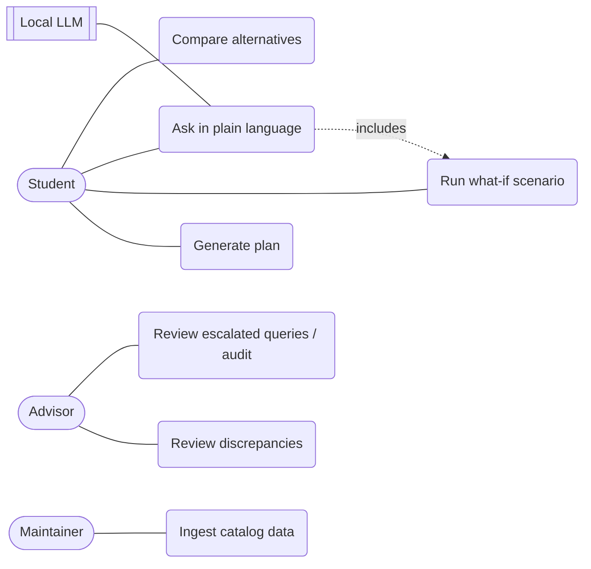

# Software Requirements Specification: Adaptive Degree Pathway Planner

Structure follows Sommerville, *Software Engineering* 10e, Fig 4.17 (based on IEEE 830). The source spec is [`spec.docx`](spec.docx).

## 1. Preface

**Readership:**
- The CSE 6550 Team 3 developers.
- The course instructor (customer and reviewer).
- Test engineers deriving release tests (§5 → [TEST_PLAN.md](TEST_PLAN.md)).
- Future maintainers.

**Version history**

| Version | Date | Change | Rationale |
|---|---|---|---|
| 0.1 | 2026-09-28 | Initial mock: engine, guardrail, API, UI on hand-seeded data | Prove the three spec goals end to end |
| 0.2 | 2026-09-28 | Real CSUSB catalog and roadmap ingestion; +/- grades, corequisites, standing, requirement groups | Replace illustrative data with authoritative sources |
| 0.3 | 2026-09-28 | This SRS, traceability, test/project/quality/CM/risk/security docs | Align with Sommerville SE process and documentation |

Changes after this version go through the change process in [QUALITY_AND_CM.md §2.3](QUALITY_AND_CM.md#23-change-management).

## 2. Introduction

CSUSB academic planning is split across four tools that don't talk to each other:
- **PAWS:** a degree audit of what's already done.
- **myCAP:** a drag-and-drop future planner with no prerequisite or availability checks.
- **Roadmap PDFs:** static recommended sequences.
- **Schedule Planner:** registration for a single term.

myCAP lets a Fall-only course be placed in Spring without any warning, which can cost a student a year.

The Adaptive Degree Pathway Planner builds a term-by-term pathway from a student's history and the degree requirements. It recalculates when something changes (a failed course, a summer term, a lighter load) and explains the graduation impact in one sentence.

A deterministic planning engine makes every scheduling decision. Generative AI is used only to turn a plain-language question into a structured scenario. That output is gated on confidence and written to an audit log (ADR-2 in [DESIGN.md](DESIGN.md)).

**Scope:**
- BS Computer Science (CSCI), CSUSB 2026-27 catalog.
- Public catalog and roadmap data only.
- Synthetic student profiles only (NFR-6).

## 3. Glossary

| Term | Meaning |
|---|---|
| Catalog | catalog.csusb.edu. Authoritative for units and prerequisites. |
| Roadmap | Official CSUSB freshman/transfer PDF. Authoritative for recommended sequence and term offering. |
| Term offering | Fall, Spring, Both, or Unknown. Summer terms offer only "Both" courses. |
| Prerequisite group | Set of alternatives, one of which must be satisfied (OR). Groups are ANDed. |
| Corequisite | Prerequisite that may be satisfied in the same term (`concurrent_ok`). |
| Grade minimum | Lowest letter grade (A…D-, +/- scale) that satisfies a prerequisite. |
| Standing | Units earned before a term. Senior standing = 90, upper-division GE = 60 (assumption). |
| Placeholder slot | GE or free-elective requirement with no specific course (e.g. `GE LD 3`). |
| Entry assumption | Prerequisite below the program's entry level (CSE 1250, MATH 1401/1403), treated as placement. |
| Ripple set | Courses invalidated by a scenario: the course, its DAG descendants planned at or after the event term, and courses whose standing no longer holds. |
| Scenario event | Pass, Fail, Withdraw, Add Summer, or Change Unit Load. |
| What-if | A scenario previewed without replacing the current plan. |
| Guardrail | The LLM + validation + threshold layer that turns plain language into a scenario event. |
| Escalation | A guardrail outcome that sends the request to human review instead of the engine. |
| Calibration | Mapping raw LLM confidence to observed accuracy (isotonic, scikit-learn). |
| Brier score / ECE | Calibration quality metrics (mean squared error; expected calibration error). |
| Discrepancy | A disagreement between catalog and roadmap, or a data error such as a cycle. Logged, never resolved automatically. |

## 4. User requirements definition

| ID | User requirement |
|---|---|
| UR-1 | Start from what the student has completed (with grades), what is in progress, and transfer units. |
| UR-2 | Respect prerequisites, including alternatives, minimum grades, corequisites, and class standing. |
| UR-3 | Produce a term-by-term plan that completes the degree. |
| UR-4 | Recalculate the plan when something changes, touching only what the change affects. |
| UR-5 | Show the graduation-timeline impact of a change in one plain-language sentence. |
| UR-6 | Offer alternative pathways (e.g. fastest vs balanced load). |
| UR-7 | Never schedule a course in a term it isn't offered; warn when a course is waiting for its offering. |
| UR-8 | Let the student explore a what-if without losing the current plan. |
| UR-9 | Accept what-if questions in plain language, safely. |
| UR-10 | Surface catalog/roadmap disagreements for advisor review. |
| UR-11 | Keep an audit trail of every AI judgment. |
| UR-12 | Build the course data from public university sources. |
| UR-13 | Check any plan (including a hand-made one or an official roadmap) against catalog rules. |

Non-functional requirements appear with the system requirements in §6.2 so their relationship to the functions stays visible (Sommerville §4.1.2).

## 5. System architecture

See [DESIGN.md](DESIGN.md) for the 4+1 views, architectural pattern, and decisions. In summary, the system is three layers:
- **Presentation:** React UI.
- **Service:** FastAPI.
- **Domain:** engine, graph, guardrail.

Planning data comes from an offline ingestion pipeline. Reused components: NetworkX (graph algorithms), Pydantic (typed models), Instructor (typed LLM output), scikit-learn (calibration), Reagraph (DAG view).

## 6. System requirements specification

Each requirement has a unique ID (Sommerville §4.6.1).

The **Verification** column says how it is shown to be met: `Test` (automated, traced in [TRACEABILITY.md](TRACEABILITY.md)), `Inspection`, `Analysis`, or `Demonstration`.

### 6.1 Functional requirements

| ID | Requirement | Source | Verification |
|---|---|---|---|
| FR-1 | The system shall treat a completed course as satisfied only if its grade is at least D- **and** meets the minimum of every prerequisite edge leaving it. Otherwise the course is re-planned as a retake. In-progress courses are assumed passed. Transfer units count toward standing. | UR-1 | Test |
| FR-2 | A course's prerequisites shall be met when every prerequisite group has at least one alternative satisfied with a grade at or above its minimum on the +/- scale. A corequisite alternative is also satisfied by a course in the same term. | UR-2 | Test |
| FR-3 | The system shall generate a plan by constrained greedy topological sort (see §6.3 FS-1). Every required course is scheduled, and no term exceeds the unit cap (Summer cap 8). | UR-3 | Test |
| FR-4 | On Fail or Withdraw, the system shall compute the ripple set (Glossary) and re-place only those courses. Every other planned course keeps its term. | UR-4 | Test |
| FR-5 | After any scenario, the system shall report graduation term, term count, total units, and critical path. It shall also report the change in regular terms and a one-sentence explanation built from a template. The explanation shall never be LLM-generated. | UR-5 | Test |
| FR-6 | The system shall offer at least two alternative pathways: *fastest* (18-unit cap) and *balanced* (12-unit cap). | UR-6 | Test |
| FR-7 | The system shall never place a course in a term whose season it is not offered in. Summer terms take only "Both" courses. "Unknown" offerings are allowed but warned. A per-term warning shall name each ready course that is waiting for its offering. | UR-7 | Test |
| FR-8 | Applying a scenario shall return a new plan and leave the submitted plan unchanged. The UI shall let the user keep or discard the result. | UR-8 | Test |
| FR-9 | A plain-language query shall be parsed by the LLM into a typed classification. It is then validated deterministically: the course exists, it is planned in the named term, the term is in the plan, and the unit load is between 3 and 21. The result is threshold-gated (§6.3 FS-3). On escalation the engine shall not be called. | UR-9 | Test |
| FR-10 | Ingestion shall detect and record these discrepancies: unit, prerequisite-set, term-offering, and program-total disagreements, plus prerequisite cycles. The catalog wins for units and prerequisites. The roadmap wins for offerings, and when roadmaps disagree the most restrictive offering is used. Discrepancies shall be shown to the user and never resolved silently. | UR-10 | Test |
| FR-11 | Every guardrail decision shall be appended to the audit log as one JSON line with: timestamp, student, input, parsed event, raw confidence, calibrated confidence, thresholds, outcome, and reason. `GET /audit` shall return the most recent entries, newest first. | UR-11 | Test |
| FR-12 | `scripts/ingest.py` shall build `catalog.json` from the public course pages, the program page, and both roadmap PDFs. It shall rebuild identically from the cached raw copies without network access. | UR-12 | Test |
| FR-13 | The validator shall check a plan for term offering, prerequisites, standing, unit cap, and completeness, and list every violation. | UR-13 | Test |
| FR-14 | The REST API shall expose the endpoints in Appendix A with the documented request/response shapes, returning 400 for invalid scenarios and 404 for unknown students. | UR-3, UR-4, UR-9 | Test |

### 6.2 Non-functional requirements

Categorized per Sommerville Fig 4.3 and stated measurably per Fig 4.5.

| ID | Requirement | Category | Verification |
|---|---|---|---|
| NFR-1 | Generating a plan for one student shall take under 200 ms on a developer laptop. | Product: performance | Test |
| NFR-2 | After Fail/Withdraw, 100% of planned courses outside the ripple set keep their term. | Product: dependability | Test |
| NFR-3 | LLM output shall never change a plan directly. 100% of AI decisions shall carry a confidence and an audit record. | Product: dependability | Test |
| NFR-4 | When the LLM is unavailable, every deterministic function stays available. NL requests escalate instead of failing. After 3 consecutive LLM failures a circuit breaker fails fast for 60 s. | Product: availability | Test |
| NFR-5 | The 0.90/0.60 thresholds are treated as calibrated only when ECE ≤ 0.02 on the labeled set (≥ 40 queries). Brier score is reported alongside. | Product: dependability | Analysis |
| NFR-6 | No real student records shall be ingested or stored. Test data is synthetic. FERPA governs real records. | External: legislative | Inspection |
| NFR-7 | Ingestion shall fetch only public pages allowed by robots.txt, with at least 2 s between requests and an identifying user agent. | External: ethical | Inspection |
| NFR-8 | The catalog is authoritative for units and prerequisites. Roadmaps are authoritative for sequence and offerings. | Organizational | Test |
| NFR-9 | The system shall run with Python ≥ 3.12 and Node ≥ 20 on Windows, macOS, and Linux. | Organizational: development | Demonstration |
| NFR-10 | Code shall pass `ruff` (E, F, I, B) and `tsc`. Every FR shall have at least one automated test. Both are enforced in CI. | Organizational: development | Test |
| NFR-11 | A first-time user shall be able to run a what-if and read its explanation within 2 minutes, unaided. | Product: usability | Demonstration |
| NFR-12 | The LLM shall be self-hosted (Ollama). Query text shall not leave the host machine. | Organizational: operational | Inspection |

### 6.3 Structured specifications (Sommerville Fig 4.13 form)

**FS-1: Generate plan** (FR-3)

| Field | Content |
|---|---|
| Function | `engine.make_plan(profile, unit_cap)` |
| Description | Assigns every remaining required course to a term. |
| Inputs | StudentProfile; unit cap (default: the profile's preference). |
| Source | `planner/students.json` or the API request; `planner/catalog.json`. |
| Outputs | `Plan{terms[TermPlan{term_label, courses, total_units, warnings}]}` |
| Action | Starting at `start_term`, each term: (1) candidates = remaining courses with standing met, prerequisites met (FR-2), offered this term (FR-7); (2) sort by priority descending (priority = out-degree + longest downstream chain + 1 if once-a-year), then id; (3) add while under cap, pulling in corequisite partners right after their lecture; repeat until nothing more fits. Continue until all are placed. |
| Requires | Prerequisite graph is acyclic (cycles rejected at load, FR-10). |
| Precondition | Every required course is reachable. Otherwise `ValueError` after 30 terms without progress. |
| Postcondition | `validate_plan(plan) == []` (FR-13). |
| Side effects | None. |

**FS-2: Apply scenario** (FR-4, FR-5, FR-8)

| Field | Content |
|---|---|
| Function | `engine.apply_scenario(profile, plan, event)` |
| Inputs | Profile, current Plan, ScenarioEvent |
| Outputs | `{plan, timeline, invalidated, delta_terms, explanation}` |
| Action | Fail/Withdraw: ripple set = course ∪ planned descendants from the event term on; re-place from the next term. Pass: credit the course; re-place descendants from the event term. Add Summer: insert the summer term; re-place everything after it. Change Unit Load: new cap from the event term on. In every case, then remove kept courses whose standing no longer holds (and their descendants) and re-place them too. |
| Precondition | The course is planned in `term_label` (Fail/Withdraw/Pass); the term is in the plan. Otherwise 400. |
| Postcondition | The input plan is unchanged. Courses outside the ripple set keep their term (NFR-2). |

**FS-3: Classify query** (FR-9, FR-11)

| Condition | Action |
|---|---|
| Breaker open (≥ 3 consecutive failures, < 60 s ago) | Escalate: "circuit breaker open" |
| LLM error, timeout, or retries exhausted | Count a failure; escalate with the error |
| Intent = unsupported | Escalate: "not a scenario question" |
| Deterministic validation fails | Escalate with the reason |
| Calibrated confidence < 0.60 | Escalate |
| 0.60 ≤ confidence < 0.90 | `accepted_low_confidence` → engine runs, flagged in audit |
| confidence ≥ 0.90 | `auto_accepted` → engine runs |

Every row writes one audit line (FR-11).

### 6.4 Use cases

## 7. System models

See [DESIGN.md §2](DESIGN.md#2-system-models): context, sequence, class, and state models.

## 8. System evolution

**Fundamental assumptions:**
- A single program (BS CS).
- The 2026-27 catalog.
- Upper-division GE needs 60 units.
- Courses not on a roadmap have an Unknown offering.
- Greedy assignment (not optimal).

**Anticipated changes** (the design keeps these open):
- More programs and subjects. The ingester is keyed by source page; requirement groups are data, not code.
- Real term-offering history from the class schedule, to replace Unknown.
- A MILP optimizer (PuLP), as the stronger alternative to greedy. The engine's `place()` is the only function that would be replaced.
- Persistence (SQLite) once plans must be saved.
- Experiment tracking (MLflow), plus an intake guardrail (`MalformedRecordCheck`). Its labeled data already exists in `backend/data/labeled_records.json`.
- Spreading GE placeholders across terms like the roadmap does. This is the largest known gap in the results.

## 9. Requirements validation record (Sommerville §4.5)

| Check | Outcome (v0.3) |
|---|---|
| Validity | Each UR maps to a spec capability or guardrail goal (spec §Purpose). |
| Consistency | NFR-8 vs FR-10 reconciled: the catalog wins for units and prerequisites, the roadmap for offerings. Roadmap-vs-roadmap conflicts use the most restrictive offering. |
| Completeness | All 8 spec capabilities covered: UR-1 through UR-8. Guardrails: UR-9 and UR-11. |
| Realism | Every FR implemented and passing in v0.2. NFR-5 needs Ollama; still open ([RISKS.md](RISKS.md) R-3). |
| Verifiability | Every FR is `Test`. `tests/test_traceability.py` fails CI if any FR loses its test. |

## Appendix A: API contract

Resolves the spec open question "API contract examples". All bodies are JSON. `Plan` is defined in `backend/planner/models.py`.

| Method, path | Request | Response |
|---|---|---|
| `GET /catalog` | none | `{courses[], edges[], priority{}, discrepancies[]}` |
| `GET /students` | none | `StudentProfile[]` |
| `POST /plan` | `{"student_id": "alex", "unit_cap": 15}` | `{plan, timeline, alternatives{fastest, balanced}}` |
| `POST /scenario` | `{"plan": Plan, "event": {"event_type": "Fail", "course_id": "CSE 2020", "term_label": "Spring 2027"}}` | `{plan, timeline, invalidated[], delta_terms, explanation}`; 400 if invalid |
| `POST /query` | `{"text": "what if I fail CSE 2020 in Spring 2027", "plan": Plan}` | `{guardrail{outcome, confidence, reason, parsed_event}, result: <scenario response> or null}` |
| `GET /audit?limit=50` | none | audit lines, newest first |

## Appendix B: Unit-load rules

Resolves the spec open question "term-offering and unit-cap rules table".

| Rule | Value | Source |
|---|---|---|
| Default cap | Student's `unit_load_preference` | Profile |
| Fastest / balanced alternatives | 18 / 12 | Design choice (FR-6) |
| Summer cap | 8 | Assumption; verify against CSUSB Academic Regulations |
| Valid `Change Unit Load` range | 3–21 | Guardrail validation (FR-9) |
| Full-time threshold | 12 units | Assumption; verify against CSUSB Academic Regulations |

## Appendix C: Data model

`backend/planner/models.py`: Course, PrerequisiteEdge, StudentProfile, TermPlan, ScenarioEvent, Plan. See the class model in [DESIGN.md](DESIGN.md#23-structural-model).
